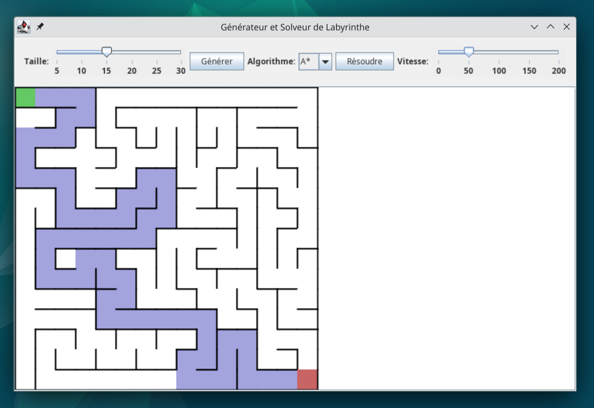

# Générateur et Solveur de Labyrinthe en Java



Une application Java avec interface graphique moderne pour générer et résoudre des labyrinthes.

## Fonctionnalités

- Génération de labyrinthes parfaits avec l'algorithme DFS (Depth-First Search)
- Résolution avec 3 algorithmes différents :
  - DFS (Depth-First Search)
  - BFS (Breadth-First Search)
  - A* (A-star)
- Interface graphique épurée et intuitive
- Contrôle de la taille du labyrinthe
- Réglage de la vitesse d'animation
- Visualisation en temps réel

## Prérequis

- Java 8 ou supérieur (JRE)

## Installation

1. Téléchargez le fichier `.jar` depuis les [Releases](https://github.com/vuycharles/labyrinthe/releases)
2. Placez-le dans le dossier de votre choix

## Utilisation

Exécutez simplement le fichier JAR :

```bash
java -jar MazeGeneratorSolver.jar
```
Ou double-cliquez dessus si Java est correctement installé sur votre système.
